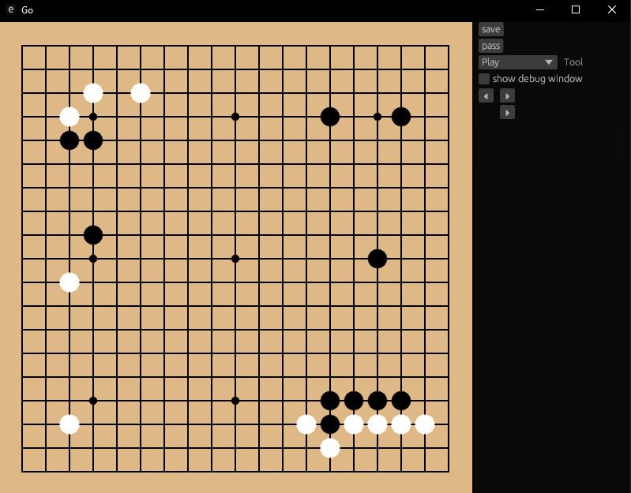

# ottobrown/go

A Go/Baduk/Weiqi client made with [rust](https://github.com/rust-lang/rust) and
[egui](https://github.com/emilk/egui)

Allows you to save and edit [sgf](https://www.red-bean.com/sgf/) files,
implementing most(?) sgf features.
